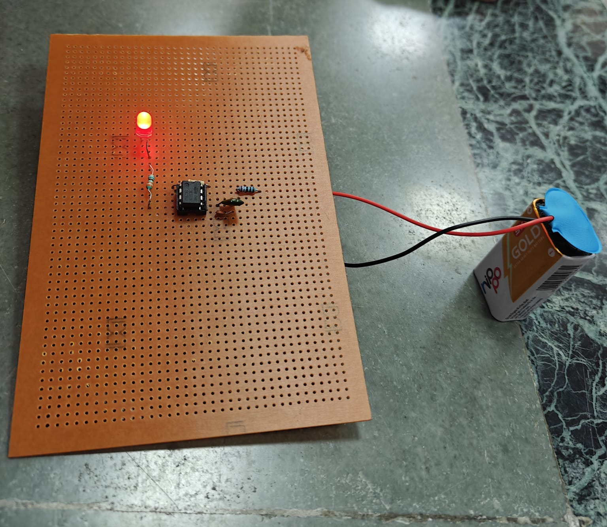
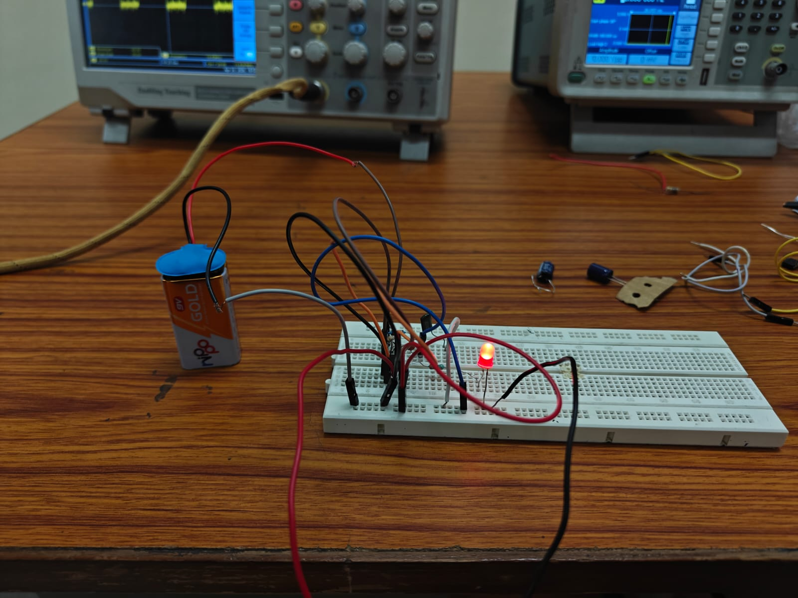
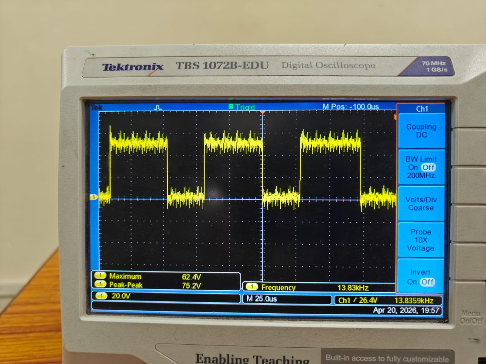

# Astable Multivibrator using 555 Timer IC (Analog — No Code)

## What it does
A transistor-based astable multivibrator circuit that generates a continuous 
square wave output, causing two LEDs to blink alternately. Fully analog — 
no microcontroller or programming involved. Built during first-year coursework.

## Components
- 2x NPN transistors (e.g. BC547)
- 2x LED
- Resistors and capacitors (RC timing network)
- Zero PCB (soldered) + breadboard prototype

## Build

[Tinkercad simulation link](https://www.tinkercad.com/things/9UWTqhIc7bS-astable-multivibrator?sharecode=24KyLWJFIdCRHLIxljLEY-yAc45WQWKRsC8CW3FnLB0)

## What I learned
- RC timing and transistor switching (charge/discharge driving base voltage)
- Soldering and hardware debugging on a zero PCB
- Foundational analog concepts that underlie timing behavior even in 
  digital/embedded systems
