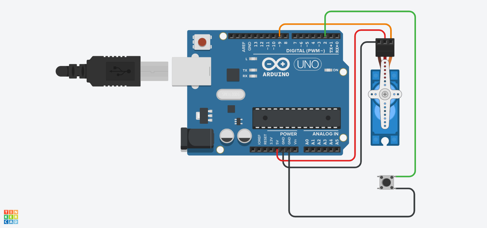

# Button-Controlled Servo Motor

## What it does
Pressing a pushbutton rotates a servo horn by 90°, alternating direction 
on each press (0° → 90° → 0°...).

## Components
- Arduino Uno
- Servo motor
- Pushbutton

## Circuit

[Tinkercad simulation link](https://www.tinkercad.com/things/8DT67wMTZcD-servo-motor-controlled-by-button?sharecode=4gg7Bd5Av9e3T1ZxnNkhdndcF5GgMuuQwOvbsL0XjVE)

## Code
See [servo_button.ino](./servo_motor.ino)
if (lastButtonState == HIGH && currentButtonState == LOW) {
    myServo.write(servoAt90 ? 0 : 90);
    servoAt90 = !servoAt90;
}

## What I learned
- Controlling servo angle with the Servo library
- Basic state toggling on button press
- Currently a known limitation: no debouncing implemented yet — 
  next step is adding either a software debounce delay or a capacitor-based 
  hardware debounce, since mechanical buttons can register multiple presses 
  from one press due to contact bounce.
