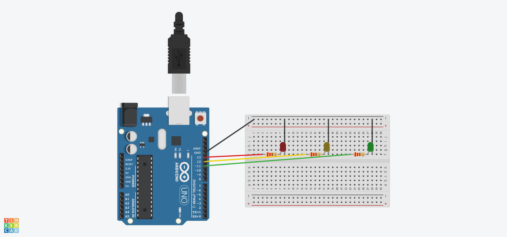

# Traffic Light Controller (Interrupt-Driven)

## What it does
A 3-LED traffic signal (red, yellow, green) that cycles through states. 
Unlike a basic delay()-based version, this uses a hardware interrupt 
(ISR) to handle timing/state changes instead of blocking delay() calls.

## Components
- Arduino Uno
- 3x LED (red, yellow, green)
- 3x 220Ω resistor

## Circuit

[View simulation on Tinkercad](https://www.tinkercad.com/things/0gxtM7LQkMI-traffic-light-timer-version)

## Code
See [traffic_light.ino](./traffic_light.ino)

## What I learned
- Difference between polling/delay() based timing and interrupt-driven timing
- Writing and attaching an ISR (attachInterrupt())
- Why ISRs should be kept short, and why shared variables need `volatile`
