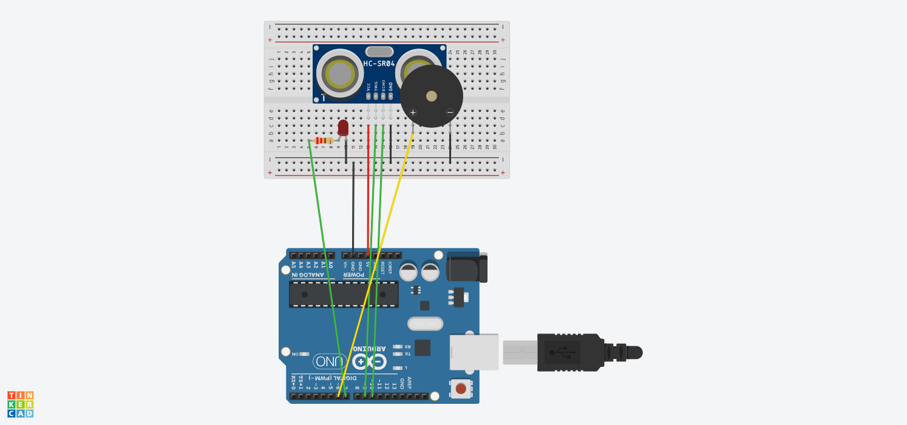

# Ultrasonic Distance Alarm

## What it does
Uses an ultrasonic sensor (HC-SR04) to measure distance. The buzzer starts 
beeping at a low frequency once an object crosses a "warning" threshold, 
and switches to a higher frequency beep once it crosses a closer "danger" 
threshold — giving proportional, distance-aware feedback rather than a single alarm state.

## Components
- Arduino Uno
- HC-SR04 ultrasonic sensor
- Buzzer

## Circuit

[Tinkercad simulation link](https://www.tinkercad.com/things/jN1Mi6UI0uC-ultrasonic-distance-alarm)

## Code
See [ultrasonic_alarm.ino](./ultrasonic_distance_alarm.ino)

## What I learned
- Measuring distance via pulse duration (pulseIn())
- Multi-threshold logic (two zones instead of one on/off condition)
- Using tone() to vary buzzer frequency based on sensor input
